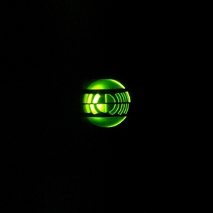
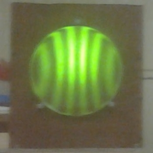

## 👋 Hello, I'm Tyler!  

  

### 🚀 About Me:
💻 Self-taught coder since 2008, proficient in JavaScript, React, PHP, HTML5, CSS3, and MySql.  
🌐 Expanded skill set to include API development, responsive web design, Java, C++, Sass, Material UI, and Web GL.  
📚 Currently pursuing a Bachelor's degree in Computer Science, set to graduate in 2026.  
🎓 Committed to continuous learning through Udemy and Coursera courses.  

### 🌍 Experience:
🌱 Founder and Developer at [https://drywall101.com](https://drywall101.com/).  
🌐 Actively involved in a global not-for-profit organization for the past 12 years.  
🤝 Managed teams ranging from 6 to 160 people in various leadership roles.  
🚀 Strong project and people management skills.  

### 🛠️ Tech Stack:
💡 Proficient in JavaScript, ReactJS, Java, PHP, OOP, HTML, CSS, MySql.  
⚛️ Experienced with Postman, Web GL, GCP (App Engine, SQL, Compute).  
☕ Java and C++ enthusiast.  
🎨 Skilled in Sass, Material UI, and Web GL.  
🔐 Google Cyber Security Certificate  

### 🧠 Passion:
🔍 I love coding for its problem-solving nature.  
🌐 Committed to leveraging technology for positive global impact.  
🚀 Thrive in dynamic, collaborative environments.  

### 🔗 Connect with Me:  
🌐 Portfolio: [https://tylerdill.dev/about](https://www.tylerdill.dev/about)  
👔 LinkedIn: [https://linkedin.com](https://www.linkedin.com/in/tyler-j-dill/)  
🐦 X / Twitter: [@tylerjdill](https://twitter.com/tylerjdill)  
📧 Email: tylerjdill@gmail.com  

Let's connect and build something amazing together! 💻✨  

### If you know what this image is, please star this repo :star2: 

   
